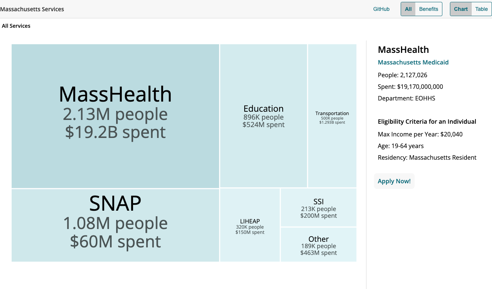

# [ma-services](https://goinvo.github.io/ma-services/): Data visualization for MA Services.
ma-services is a data visualization to show all Massachusetts services with their sizes, government spending, and eligibility criteria.  <br />
ma-services is built using HTML, CSS, JS and [D3](https://d3js.org/).



## Usage
It's easy to filter by type of service, and see different views. <br />

| Views | Filters | 
| ----- | ---- |
| Tree Map | All Services | 
| Table | Benefits Only | 
|       | Other | 

Within All and Benefits, the Other section expands to show small enrollment sized services       


## Installation
To edit the ma-services repo locally, you need to install node.js:
```bash
$ npm install -g npm
```

To view changes as you work, install http-server using Homebrew:
```bash
$ brew install http-server
$ npm install http-server
```

Clone the repo to your local machine:
```bash
$ git clone https://github.com/goinvo/ma-services.git
```

To run the server:
```bash
$ cd ma-services
$ http-server
$ cd ma-services
$ http-server
```

## Research
To view our research, see the master [google sheets](https://docs.google.com/spreadsheets/d/16CN-S0y3l6Tk8TizFWQkr3FHQ8-0W07K2vIyocaVyzY/edit?usp=sharing) document.<br />
Enrollment and spending statistics are mainly from FY2023. 

## Next Steps
Currently, ma-services is only showcasing a few of the most commmonly used Massachusets services. The next step is to add more services to the visualization.
<br /><br />
To update the dataset, update the JSON files in this repo. <br />
Additionally, the data for each JSON file is a google sheet in the MAServices --> Sheets to JSON Google Drive folder

### Core Contributors
Founders/Designers: [GoInvo](http://www.goinvo.com) is a digital design studio in Boston, crafting the future of healthcare through strategy, creativity, and vision.

### Contact Us
[hello@goinvo.com](mailto:hello@goinvo.com)  

### License
ma-services is [CC0-1.0](https://github.com/goinvo/ma-services?tab=CC0-1.0-1-ov-file) licensed.

